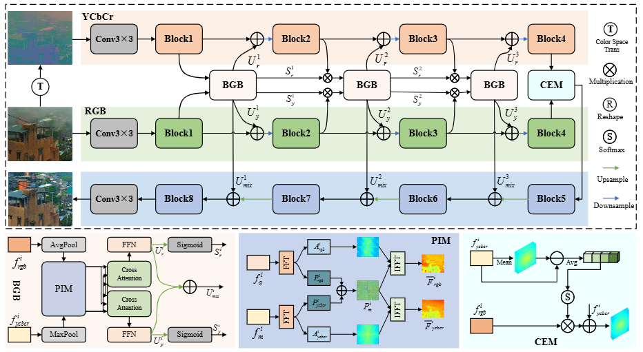

# Guided Real Image Dehazing using YCbCr Color Space (AAAI'2025)


> *<a href="https://github.com/fiwy0527/AAAI_25_SDGN">Wenxuan Fang</a><sup>1</sup>&nbsp;&nbsp;&nbsp;
<a href="https://fanjunkai1.github.io/">Junkai Fan</a><sup>1</sup>&nbsp;&nbsp;&nbsp;
<a href="https://github.com/fiwy0527/AAAI_25_SDGN"> Yu Zheng</a><sup>1</sup>&nbsp;&nbsp;&nbsp;
<a href="https://wengjiangwei.github.io/">Jiangwei Weng</a><sup>1</sup>&nbsp;&nbsp;&nbsp;
<a href="https://tyshiwo.github.io/">Ying Tai<sup>2</sup>&nbsp;&nbsp;&nbsp;
<a href="https://sites.google.com/view/junlineu/">Jun Li</a><sup>1 ✉️</sup>&nbsp;&nbsp;&nbsp;*

> *<sup>1</sup>School of Computer Science and Engineering, Nanjing University of Science and Technology (Nanjing)&nbsp;&nbsp;&nbsp;<br>
<sup>2</sup>Intelligence science and technology, Nanjing University&nbsp;&nbsp;&nbsp;<br>*


<em>The Association for the Advancement of Artificial Intelligence <strong>(AAAI)</strong>, February 25 – March 4, 2025 | Philadelphia, Pennsylvania, USA</em>
</div>

</br>

[](https://github.com/fiwy0527/AAAI_25_SDGN)
[](https://github.com/fiwy0527/AAAI_25_SDGN)
[](https://github.com/fiwy0527/AAAI_25_SDGN)


## Abstract


> **Image dehazing, particularly with learning-based methods, has gained significant attention due to its importance in real-world applications. 
> However, relying solely on the RGB color space often fall short, frequently leaving residual haze. 
> This arises from two main issues: the difficulty in obtaining clear textural features from hazy RGB images and the complexity of acquiring real haze/clean image pairs outside controlled environments like smoke-filled scenes. 
> To address these issues, we first propose a novel Structure Guided Dehazing Network (SGDN) that leverages the superior structural properties of YCbCr features over RGB. 
> SGDN comprises two key modules: Bi-Color Guidance Bridge (BGB) and Color Enhancement Module (CEM). 
> BGB integrates a phase integration module and an interactive attention module, utilizing the rich texture features of the YCbCr space to guide the RGB space, thereby recovering clearer features in both frequency and spatial domains. 
> To maintain tonal consistency, CEM further enhances the color perception of RGB features by aggregating YCbCr channel information. 
> Furthermore, for effective supervised learning, we introduce the Real-World Well-Aligned Haze (RW$^2$AH) dataset, which includes a diverse range of scenes from various geographical regions and climate conditions. 
> Experimental results demonstrate that our method surpasses existing state-of-the-art methods across multiple real-world smoke/haze datasets.**


## Overview 
  <p align="center">
    
</p>

---

> *The overall pipeline of our SGDN. 
> It includes the proposed Bi-Color Guidance Bridge (BGB) and Color Enhancement Module (CEM). 
> BGB promotes RGB features to produce clearer textures through YCbCr color space in both frequency and spatial domain, while CEM significantly enhances the visual contrast of the images.*

## Real-World Well-Aligned Haze Dataset
**Click here to get the dataset. Baidu Disk: <a href="[https://github.com/fiwy0527/AAAI_25_SDGN](https://pan.baidu.com/s/1eOTFkittMX70RehK6zK3YQ)/">Dataset</a>**. Code: **67sx**

> **To enable effective supervised learning, 
> we collect a real-world haze dataset featuring multiple scenes and varying haze concentrations, 
> named the Real-World Well-Aligned Haze (RW$^2$AH) dataset, with a total of 1758 image pairs. 
> The RW$^2$AH dataset primarily records haze/clean images captured by stationary webcams from YouTube, 
> with scenes including landscapes, vegetation, buildings and mountains.**

 

 

## Visual Comparisons

<details>
<summary><strong>Real-world Smoke/Haze </strong> (click to expand) </summary>

 
</details>

## Results
<details>
<summary><strong>Real-world Smoke/Haze</strong> (click to expand) </summary>

 
</details>

## Installation
:satisfied: Our <i><strong>SGDN</strong></i> is built in Pytorch=2.0.1, we train and test it on Ubuntu=20.04 environment (Python=3.8+, Cuda=11.6).

First, for tool initialization, please refer to [BasicSR](https://github.com/xinntao/BasicSR)

Secondly, please follow these instructions:
```
conda create -n py38 python=3.8.16
conda activate py38
pip3 install torch torchvision torchaudio
pip3 install -r requirements.txt  
```

## Training and Test
Organizing! Come Soon...


## Contact
If you have any questions, please contact the email wenxuan_fang@njust.edu.cn
**Acknowledgment:** This code is based on the [BasicSR](https://github.com/xinntao/BasicSR) toolbox. 
